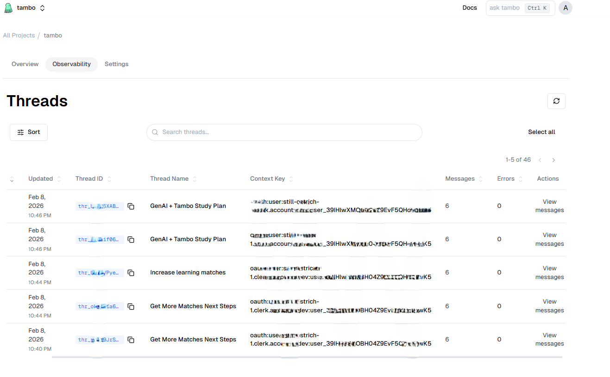
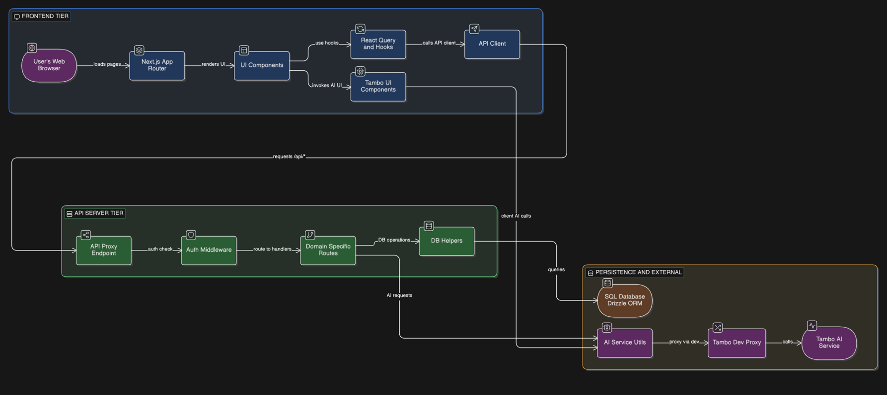
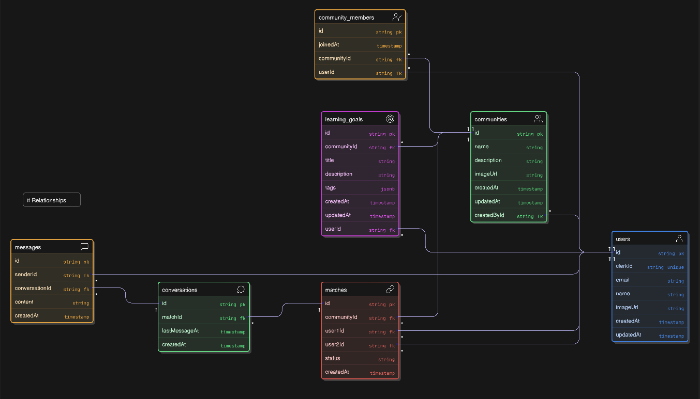

# PeerPath

PeerPath is a full-stack learning partner platform where users join communities, add learning goals, get AI-based match suggestions, and chat with matched peers.

## Links

- GitHub: [Arjunhg/peerpath](https://github.com/Arjunhg/peerpath)
- Live: [peerpath-mu.vercel.app](https://peerpath-mu.vercel.app/)

## Visual

### Tambo Panel



### Application Architecture



### Database Structure



## Current Feature Set

- Public landing page with marketing sections (`app/page.tsx`).
- Authentication via Clerk (`app/layout.tsx`, `proxy.ts`, sign-in/sign-up routes).
- Main authenticated app:
  - Dashboard (`app/(main)/dashboard/page.tsx`)
  - Communities (`app/(main)/communities/page.tsx`, `app/(main)/communities/all/page.tsx`)
  - Chat (`app/(main)/chat/page.tsx`, `app/(main)/chat/[matchId]/page.tsx`)
- AI partner matching from community goals (`lib/ai.ts`, `app/server/matches-routes.ts`).
- Conversation summaries + action items generated from chat history (`app/server/conversations-routes.ts`, `lib/ai.ts`).

## Architecture Overview

### Frontend

- Next.js App Router + React 19 + TypeScript.
- UI built with reusable components in `components/ui/*`.
- Motion/transitions via `framer-motion`.
- Client data state managed with React Query (`components/providers/query-provider.tsx`).
- API calls use a typed Hono client (`lib/api-client.ts`).

### API Layer

- API entrypoint: `app/api/[[...route]]/route.ts`.
- Server framework: Hono running on Next.js route handlers.
- Route modules:
  - `app/server/community-routes.ts`
  - `app/server/learning-goals-routes.ts`
  - `app/server/matches-routes.ts`
  - `app/server/conversations-routes.ts`
- Most API routes require auth; `/api/communities/all` is the main public API path.

### Authentication

- Clerk middleware in `proxy.ts` protects app/API paths.
- API middleware reads Clerk session and sets `userId`.
- `authMiddleware` resolves app user records through `getOrCreateUserByClerkId` (`lib/user-utils.ts`).

### Data Layer

- PostgreSQL + Drizzle ORM (`db/schema.ts`, `db/index.ts`).
- Core entities:
  - `users`, `communities`, `community_members`, `learning_goals`
  - `matches`, `conversations`, `messages`, `conversation_summaries`
- Drizzle migrations/config:
  - `drizzle.config.ts`
  - `drizzle/*`
- Seed data script: `db/seed.ts`.

### AI Layer (Matching + Summaries)

- AI SDK + OpenAI model (`gpt-5-nano`) is used in `lib/ai.ts`.
- Two implemented AI flows:
  - partner matching based on community goal similarity
  - chat summary generation with `summary`, `keyPoints`, `actionItems`, `nextSteps`

## Tambo Integration

Tambo is integrated as an in-app copilot UI, not as a separate backend.

### Where it is used

- Dashboard copilot panel (`app/(main)/dashboard/page.tsx`)
- Chat coach copilot panel (`components/chat/chat-interface.tsx`)

### How it is wired

- Provider/auth wrapper: `components/providers/tambo-provider.tsx`
  - Uses Clerk `getToken({ template: "tambo" })` for `userToken`.
- Copilot panel UI: `components/tambo/copilot-panel.tsx`
- Tool + component registry: `components/tambo/registry.tsx`

### What it does in this project

- Calls local app APIs through Tambo tools:
  - `get_dashboard_snapshot`
  - `find_partners_for_community`
  - `get_conversation_coaching`
- Renders structured components in responses:
  - `DashboardInsightsCard`
  - `PartnerRecommendationsList`
  - `ConversationSummaryCard`
  - `ActionChecklist`

### What it does not do

- It does not replace your API routes or database layer.
- It depends on existing `/api/*` routes for data and actions.

## API Surface (Implemented)

- Communities:
  - `GET /api/communities/all`
  - `GET /api/communities`
  - `POST /api/communities/:communityId/join`
  - `GET /api/communities/:communityId/goals`
  - `POST /api/communities/goals`
  - `GET /api/communities/goals`
- Matches:
  - `POST /api/matches/:communityId/aimatch`
  - `GET /api/matches/:communityId/matches`
  - `GET /api/matches/allmatches`
  - `PUT /api/matches/:matchId/accept`
  - `GET /api/matches/:matchId/conversation`
- Conversations:
  - `GET /api/conversations/:conversationId/messages`
  - `POST /api/conversations/:conversationId/messages`
  - `POST /api/conversations/:conversationId/summarize`
  - `GET /api/conversations/:conversationId/summary`

## Environment Variables

Create `.env.local` for runtime values:

```bash
DATABASE_URL=
NEXT_PUBLIC_CLERK_PUBLISHABLE_KEY=
CLERK_SECRET_KEY=
OPENAI_API_KEY=
TAMBO_API_KEY=
```

Create `.env` with at least:

```bash
DATABASE_URL=
```

`drizzle.config.ts` reads `.env`, while app runtime code reads `.env.local`.

In Clerk, create a JWT template named `tambo` because `getToken({ template: "tambo" })` is used for Tambo auth.

## Local Setup

1. Install dependencies:

```bash
bun install
```

2. Push schema to your database:

```bash
bun run db:push
```

3. (Optional) Seed local data:

```bash
bun run db:seed
```

4. Start development server:

```bash
bun run dev
```

5. Open `http://localhost:3000`.

## Scripts

- `bun run dev` - start local dev server
- `bun run build` - production build
- `bun run start` - run production server
- `bun run lint` - run ESLint
- `bun run db:generate` - generate drizzle migrations
- `bun run db:push` - push schema to DB
- `bun run db:studio` - open drizzle studio
- `bun run db:seed` - seed sample data
